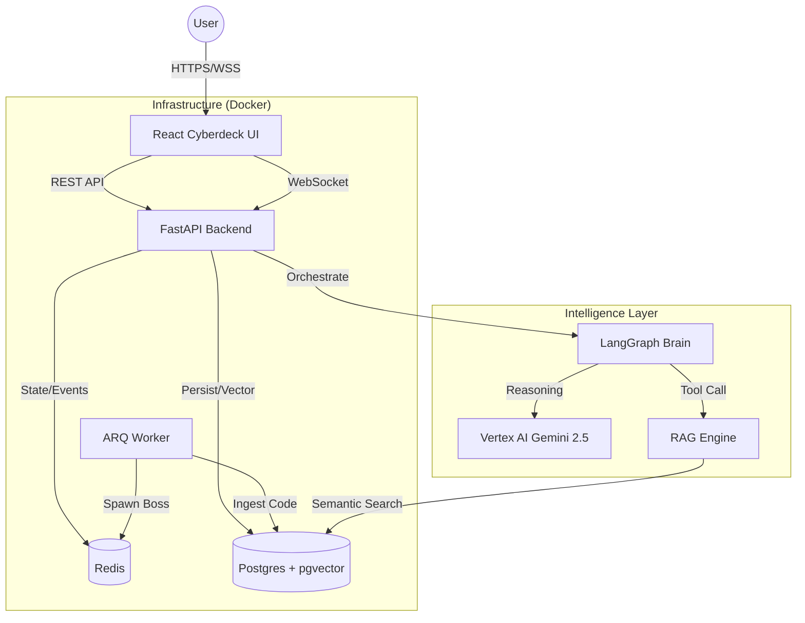

# 🍌 EvalForge: The Agentic Developer RPG

**EvalForge** is an AI-powered career simulator that turns your codebase into a video game. It uses **Agentic RAG** to read your repositories and generate gamified engineering quests, helping you master your own stack through "Socratic" coaching and real-time events.


## 🚀 Key Features

* **🧠 Neuro-Symbolic Agents:** Uses **LangGraph** to model reasoning loops. The "Explain Agent" doesn't just guess; it checks documentation and your actual code before answering.
* **📚 Agentic RAG:** Ingests GitHub repositories, clones them, builds a file tree map, and indexes code into **pgvector** for semantic retrieval.
* **⚡ Event-Driven Architecture:** A background **Redis** worker simulates "System Outages" (Boss Fights) and pushes them to the client via **WebSockets** in real-time.
* **🎮 Gamification Engine:** Persistent XP, leveling, and skill tracking backed by **Postgres**.
* **🖥️ Cyberdeck UI:** A fully themed "Hacker" interface built with React, Tailwind, and Framer Motion.

## 🏗️ Architecture



## 🛠️ The Tech Stack

* **Backend:** FastAPI, SQLModel (Async), LangChain/LangGraph, ARQ (Workers).
* **Frontend:** React, TypeScript, Vite, Zustand (State), Tailwind CSS.
* **Infrastructure:** Docker Compose, PostgreSQL (pgvector), Redis.
* **AI Provider:** Google Vertex AI (Gemini 2.5 Flash + text-embedding-004).

## ⚡ Quick Start

1.  **Clone & Configure:**
    ```bash
    git clone https://github.com/yourusername/evalforge.git
    cp .env.example .env
    ```

2.  **Launch the Stack:**
    ```bash
    docker-compose up --build
    ```

3.  **Access the Cyberdeck:**
    * Frontend: `http://localhost:5173`
    * API Docs: `http://localhost:8092/docs`

## 🧪 Testing

The platform is covered by a comprehensive test suite (Backend + Frontend + E2E).

```bash
# Run all tests
./scripts/test_all.ps1
```
